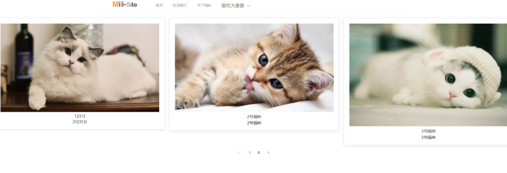

# Mili-Site
喵站是为了收集纯净的猫咪照片而设计的网站。采用人工智能审核技术，只能上传与猫咪有关的无水印照片。

# 主页

具体的前端界面请查看了我的另一个仓库: https://github.com/YF-Gooo/milisite-vue
# 预备工作
1. 先使用docker-compose一键开启redis和mysql
2. 去阿里云注册账号，开启oss
3. 修改.env.example

# 启动程序
    export GOPROXY=https://mirrors.aliyun.com/goproxy/
    export GO111MODULE=on
    go run main.go

# Todo
1. 用户管理后台接口
2. 图像审核人工智能(删除非猫咪图片，和有水印的图片)
3. qq第三方登录功能
4. 审核消息队列搭建(暂定RabbitMQ)
5. 构建cicd流程

# 本项目主要参考了
